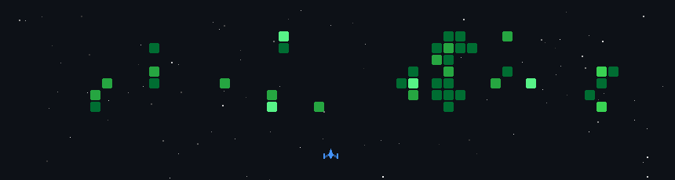

# Berke Uğur Aksakal

M.Sc. AI for Smart Sensors & Actuators @ THD — Computer Vision · Robotics · Embedded Systems

`Python` `PyTorch` `OpenCV` `YOLOv8` `ROS` `Docker` `C++`

📍 Cham, Germany · 🌐 [berkeuguraksakal.com](https://berkeuguraksakal.com) · [GitHub](https://github.com/BUAksakal)

 

